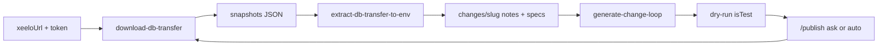

# Xeelo Agent Playbook

**Start here** when asked to create or modify Xeelo configuration for a project.

## What is the KB

**KB** = this repository **except** `projects/` and `internal/`.

| Path | Role |
|------|------|
| `docs/`, `recipes/`, `data/`, `scripts/`, `AGENT.md`, skills, … | Knowledge base. When the user asks what the KB contains or what it says, answer **only** from here. |
| `projects/` | Site working copies (env, snapshots, change loops). Gitignored; one **private** git repo = the whole directory. You may **draw from** them when implementing. They are **not** KB content. |
| `internal/` | Optional local playbook (gitignored). Product-source index for this machine. **Not** KB. If it exists, read it when the KB is incomplete or when re-verifying platform behaviour. Write extracted facts back into the public KB **only in `project-kb` work mode** — do not copy source paths into `docs/` or `recipes/`. |

Do not present `projects/` or `internal/` as “what’s in the KB”. Mention a project path only if the user asks for a sample or a specific site.

**Check `projects/` first** before creating a site, downloading a DB transfer, or otherwise using that tree. If it has no site folder and no nested `projects/.git`, explain the nested-repo intent and **offer** to initialize it — do not silently scaffold `projects/<name>/`. Canonical text and commands: [docs/projects.md](docs/projects.md).

## Work mode

Source of truth: `internal/work-mode.md` (gitignored; this machine only; shared across chats). Read it before site work. Do not present it as KB. Do not rewrite it unless the user asks to switch.

```markdown
mode: project
```

Allowed values: `project` | `project-kb`. Missing `internal/`, missing file, empty, or any other value → **`project`**.

| Mode | Site work | KB (`docs/`, `recipes/`, `data/`, `scripts/`, `AGENT.md`, skills, `.cursor/rules/`) |
|------|-----------|-------------------------------------------------------------------------------------|
| **`project`** (default) | Edit `projects/<name>/` | **Read** only. If you hit a KB gap, one sentence at the end — do not fix it. |
| **`project-kb`** | Same | Also **harvest**: write repeatable platform facts (enum, recipe step, spec field, Admin/GraphQL behaviour). Not site-specific data, not `internal/` paths, not a chat dump. |

Direct KB requests (“fix this recipe”, “what does the KB say about GraphQL”) are **not** gated.

Announce once at the start of site work (`Režim: project` or `Režim: project-kb`), not on every reply. If `projects/<name>/conventions.md` exists, **read it** before creating or editing objects (language, naming, agent loop, other site rules).

## Development loop



1. **Connect** — user provides Xeelo URL + GraphQL admin token → `projects/<project>/.xeelo-connection.json` (gitignored)
2. **Download** DB transfer JSON → `projects/<project>/snapshots/<stamp>/`
3. **Extract env** — catalog + shared + per-object specs under `projects/<project>/env/`
4. **Change loop** — `changes/<slug>/` with `tasks.md` (checklist), **`notes.md`** (requested vs done), copied object specs, generated Object Transfer in `output/`. Write or update `notes.md` while working, not as an afterthought.
5. **Dry-run** — after generate, **immediately** run `scripts/push-object-transfer.py --only-test` (upload with `isTest: true`). Do **not** ask first. If it fails, report messages and do **not** offer `/publish`. If connection is missing, skip dry-run with one sentence and do not offer `/publish`.
6. **Publish** — only after a successful dry-run. `/publish` applies the OT for real and precompiles; then `/download-db` refreshes `env/`. Follow **Agent loop** in `projects/<name>/conventions.md` (below). Default is **ask**.

There is **no** `/push` skill. `/precompile` is precompile only (not part of the loop).

### Agent loop in conventions

Keys in `projects/<name>/conventions.md` (allowed: `ask` | `auto`; missing section or key = `ask`):

- **Publish after dry-run**
- **Download-db after publish**

The two keys are independent. Template: [`templates/project/conventions.md`](templates/project/conventions.md).

| Value | After successful dry-run / after successful `/publish` |
|-------|--------------------------------------------------------|
| **`auto`** | Run the skill. **Announce** that this site’s conventions say so. |
| **`ask`** | Offer three options. Do not run unless they pick a run option or invoke the skill. |

**Publish after dry-run** (`ask`): **Publish now** / **Publish now and remember for this site** / **Don't publish**.

**Download-db after publish** (`ask`): **Refresh env now** (`/download-db`) / **Refresh now and remember** / **Don't download**. Offer this only after a successful `/publish`.

**Remember** → set that key to `auto` in this site’s `conventions.md` (add the **Agent loop** section if missing). User says stop doing it yourself → set that key back to `ask`. A one-loop exception (“don’t publish this time”) does **not** change conventions.

Failed dry-run or missing connection: do not offer `/publish`, do not write conventions. Failed `/publish`: do not run `/download-db`.

### Site vs company

| Term | Meaning | Where |
|------|---------|--------|
| **site** | Xeelo instance (`xeeloUrl` + GraphQL admin token) | `.xeelo-connection.json` |
| **company** / `companyId` | Logical object division (`Company` table in DB transfer) | spec `company.name`, `ids.explicit.companyId`, `catalog.yaml` |

Example: lz company KB has `Company.CompanyID: 9001` in the DB transfer. Extract includes **all** objects from the site; `companyId` is metadata on each object, not a filter parameter.

| Action | Resource |
|--------|----------|
| Download DB transfer | [`scripts/download-db-transfer.py`](scripts/download-db-transfer.py) |
| Parse / env | [`scripts/extract-db-transfer-to-env.py`](scripts/extract-db-transfer-to-env.py), [db-transfer-format.md](docs/transfer/db-transfer-format.md) |
| Init loop | [`scripts/init-change-loop.py`](scripts/init-change-loop.py) |
| Generate change OT | [`scripts/generate-change-loop.py`](scripts/generate-change-loop.py) |
| Dry-run OT (`isTest`) | [`scripts/push-object-transfer.py`](scripts/push-object-transfer.py) `--only-test` |
| Publish (real OT + precompile) | [`scripts/publish-object-transfer.py`](scripts/publish-object-transfer.py) |
| Precompile only | [`scripts/precompile-settings.py`](scripts/precompile-settings.py) |
| Spec language | [spec-format.md](docs/transfer/spec-format.md) |
| Update actions | [docs/entities/update-actions.md](docs/entities/update-actions.md), [recipes/add-update-action.md](recipes/add-update-action.md) |
| Object messages | [docs/entities/object-messages.md](docs/entities/object-messages.md) (HTML modal on create/update/workflow) |
| Object actions / Node.js | [object-actions.md](docs/entities/object-actions.md), [nodejs-esm.md](docs/entities/nodejs-esm.md), [recipes/add-object-action.md](recipes/add-object-action.md), [nodejs-graphql-patterns.md](recipes/nodejs-graphql-patterns.md) |
| GraphQL schema | [docs/entities/graphql.md](docs/entities/graphql.md) (`Select_` / `Mutate_`, `lines` vs `linesFormatted`) |
| Localization | [docs/entities/localization.md](docs/entities/localization.md) (`LanguageTable`, `spec/language-table.yaml`) |
| Object Transfer format | [object-transfer-format.md](docs/transfer/object-transfer-format.md) |

Object Transfer JSON is a **delta vs the latest DB-transfer download**: emit a row only when it is **new** or its generated cells **differ** from the snapshot. FK columns may point at Orig. IDs that already exist on the site — do not re-send the referenced row. `/publish` applies that subset (Orig. ID upsert). Manual Admin UI still works for selecting rows in batches.

Object Transfer **upserts** by Orig. ID — it does not delete. Soft-disable with `isActive: false` on the same ID (`ObjectUpdateAction`, `ObjectAction`, …). Omit the row and the site copy stays active.

## Creating a new project

When the user asks for a **new empty project** (`projects/<name>/`):

0. **Check `projects/`** — see [docs/projects.md](docs/projects.md). If there is no site and no nested git, explain the public-KB / private-`projects/` split, **offer** nested-repo init (template + `git init`), and give instructions for the user to host a **private** remote. Do not create the remote. Do not scaffold the site until `projects/` is ready (or the user already has sites / nested git).
1. Create the folder with empty `snapshots/`, `env/`, `changes/` (`.gitkeep` if needed for git).
2. Copy [`templates/project/conventions.md`](templates/project/conventions.md) to `projects/<name>/conventions.md`.
3. Add **only** `projects/<name>/.xeelo-connection.json` — **no** `.xeelo-connection.example.json`.
4. Fill **placeholder / empty** values. Do **not** copy `token` from other projects.
5. You may **infer** `xeeloUrl` as `https://<name>.xeelo.online/` when that matches the site slug; leave it empty if unsure.
6. After creation, **tell the user exactly what to fill in** (see checklist below).

Template (empty values for user to complete):

```json
{
  "xeeloUrl": "https://<name>.xeelo.online/",
  "token": ""
}
```

**User checklist** (agent reports this after scaffold):

| Field | Where to get it |
|-------|-----------------|
| `xeeloUrl` | Xeelo site URL (User UI); confirm inferred URL if used |
| `token` | GraphQL **admin** access token (`isAdmin`). Fixed; no refresh |

File is gitignored in both xeelo-skills and the nested projects repo (`**/.xeelo-connection.json`). Commit the new site folder in `projects/` (the private repo), not in xeelo-skills. Do not download DB transfer until the user has filled connection details.

## Ask which workflow

**Always ask** before writing workflow on a **new object** or a **new update action**. Do not default silently. Skip the question only when the user already chose in the same request (“new workflow” / “use workflow X” / “keep template workflow”).

List existing workflows from `projects/<site>/env/`: `catalog.yaml` (`objects[].name`, `slug`, `workflowIds`), `env/objects/<slug>/spec/workflow.yaml` (`workflow.name`, steps), `env/objects/<slug>/spec/ids.yaml` (`ids.explicit.workflowId`). Each option: **object — workflow name — id** (optional step summary). Empty or stale env → only “new workflow”, or `/download-db` first.

**Use existing** = share the same `Workflow` row (Orig. ID), not a clone of steps. Copy `spec/workflow.yaml` (for step keys / access) + `ids.explicit` (`workflowId`, `workflowSteps`, `workflowStepActions`, roles/statuses) and set **`workflow.reuse: true`** so generate does not rewrite the shared process. Bind `ObjectDefault.WorkflowID` to that Orig. ID. Unchanged catalog rows (`Company`, `ObjectType`, `Role`, …) are omitted vs the download even when Object FKs still reference them. `WorkflowStepAccess` is per `(step, object line)` — the new object’s lines get access rows on the shared steps; do not change steps/actions unless the user asks.

### Creating a new object

Before `spec/workflow.yaml` (and before `workflow.mode: minimal`):

1. **New workflow** — new `Workflow` row (minimal Draft → Active → Completed unless the user described steps).
2. **Existing workflow** — pick from the env list. Set `workflow.reuse: true` and bind `ObjectDefault.WorkflowID` to that Orig. ID.

Never create an object with a silent new minimal workflow. Recipe: [create-object.md](recipes/create-object.md).

### Adding an update action

Before `spec/update-actions.yaml`, ask which workflow the **new request version** should use (`ObjectUpdateAction.WorkflowID`). First option is **Recommended**:

1. **Default template workflow** — `ObjectDefault` with `isDefault: true` (or the only template). **Omit** `updateActions[].workflow` (`WorkflowID` NULL; runtime uses the template). Source: `spec/templates.yaml` + the object’s `ids.explicit.workflowId` / `spec/workflow.yaml`.
2. **Another existing workflow** — from the env list; set `updateActions[].workflow` to that shared Orig. ID.
3. **New workflow** — new `Workflow` row for this update version.

Recipe: [add-update-action.md](recipes/add-update-action.md). Runtime fallback: [update-actions.md](docs/entities/update-actions.md).

## Skills

Canonical location: [`.agents/skills/`](.agents/skills/) (Cursor, Codex, Gemini; Claude in Cursor). Invoke with `/new-project`, `/download-db`, `/publish`, `/precompile`, and `/graphql`.

| Skill | When | File |
|-------|------|------|
| `/new-project` | New empty Xeelo site under `projects/<name>/` | [`.agents/skills/new-project/SKILL.md`](.agents/skills/new-project/SKILL.md) |
| `/download-db` | Download DB transfer JSON and extract `env/` | [`.agents/skills/download-db/SKILL.md`](.agents/skills/download-db/SKILL.md) |
| `/publish` | Apply Object Transfer for real and precompile | [`.agents/skills/publish/SKILL.md`](.agents/skills/publish/SKILL.md) |
| `/precompile` | Precompile settings only (no transfer) | [`.agents/skills/precompile/SKILL.md`](.agents/skills/precompile/SKILL.md) |
| `/graphql` | Live schema + `access_rights` from `POST {xeeloUrl}/graphql` | [`.agents/skills/graphql/SKILL.md`](.agents/skills/graphql/SKILL.md) |

After generate, **auto-run** dry-run `--only-test`. Then `/publish` per **Publish after dry-run** in conventions (`ask` unless `auto`), then `/download-db` per **Download-db after publish**. There is no `/push` skill.

### Change loop `notes.md`

`tasks.md` = checklist only. **`notes.md`** = narrative for the next human or agent. Write or update it whenever you edit specs or generate OT in that loop.

```markdown
# Change loop: <slug>

## Requested

(what the user asked; prompt/plan excerpts OK — not the whole chat)

## Done

(what actually changed: objects, files, behaviour — not a raw diff)
```

On later rounds in the same loop, **append** (new bullets or a dated subsection). Do not silently rewrite earlier history.

Claude Code CLI does not scan `.agents/skills/`; [CLAUDE.md](CLAUDE.md) points it at these files.

## Project layout

`projects/<project>/` = one Xeelo site.

```text
projects/ovnet/
  conventions.md                  # site rules (language, naming, agent loop); read before object work
  .xeelo-connection.json          # gitignored — xeeloUrl + GraphQL admin token
  graphql/{schema,access_rights}.json  # live introspection — gitignored; refresh with /graphql
  snapshots/<stamp>/*.json        # DB transfer JSON from GraphQL (UTF-8)
  env/
    catalog.yaml
    shared/{companies,object-types,roles,statuses,sources,custom-colors}.yaml
    objects/<slug>/{xeelo-spec.yaml,spec/...}
  changes/<loop-slug>/
    tasks.md                      # checklist
    notes.md                      # requested vs done (prompt/plan excerpts OK)
    baseline.yaml
    objects/<slug>/...
    output/*-object-transfer.json
```

## Commands

```bash
# 0) Download latest DB transfer (needs connection file)
python scripts/download-db-transfer.py \
  --connection projects/ovnet/.xeelo-connection.json

# 1) Extract env (all objects from the site)
python scripts/extract-db-transfer-to-env.py \
  projects/ovnet/snapshots/<stamp>/<name>.json \
  -o projects/ovnet/env

# 2) Start a change loop
python scripts/init-change-loop.py \
  --project projects/ovnet \
  --slug 20260811-loop-01-short-name \
  --objects ov-net-customer

# 3) Edit changes/<slug>/objects/... then generate OT packages
python scripts/generate-change-loop.py \
  projects/ovnet/changes/20260811-loop-01-short-name

# 4) Dry-run OT (isTest) — run automatically after generate
python scripts/push-object-transfer.py \
  --connection projects/ovnet/.xeelo-connection.json \
  --loop projects/ovnet/changes/20260811-loop-01-short-name \
  --only-test

# 5) Publish: apply JSON (isTest false) + precompile (only if the user says yes)
python scripts/publish-object-transfer.py \
  --connection projects/ovnet/.xeelo-connection.json \
  --loop projects/ovnet/changes/20260811-loop-01-short-name

# 6) Precompile only (no Object Transfer)
python scripts/precompile-settings.py \
  --connection projects/ovnet/.xeelo-connection.json
```

Connection example: [`projects/ovnet/.xeelo-connection.json`](projects/ovnet/.xeelo-connection.json) (gitignored; see **Creating a new project** above)

## Empty site (fresh env)

A **new or empty Xeelo site** is a normal, successful extract — not a tooling error.

After download + extract you may see:

```text
Wrote projects/<project>/env (catalog=0 objects, extracted=0)
```

Typical `env/` layout:

- `catalog.yaml` — `objects: []`, empty `companies` / `objectTypes` lists
- `shared/*.yaml` — mostly empty maps (`companies: {}`, …)
- `extract-summary.yaml` — `catalogObjects: 0`, `extractedObjects: []`
- **no** `objects/<slug>/` tree until custom objects exist in Admin

Reference sample: [`projects/lz/`](projects/lz/) (test site).

**Before/after greenfield deploy** (same site):

| Stage | Snapshot | Catalog |
|-------|----------|---------|
| Empty site | [`snapshots/20260813_111646/`](projects/lz/snapshots/20260813_111646/) | 0 objects |
| After Transakce OT | [`snapshots/20260813_132321/`](projects/lz/snapshots/20260813_132321/) | 1 object, company KB `9001` |

Env after deploy: [`projects/lz/env/objects/transakce/`](projects/lz/env/objects/transakce/).

**Known generator fix:** `IdRegistry` must cache allocated IDs so workflow roles and update-action line refs stay consistent across OT rows (fixed in `scripts/ot_builder/ids.py`).

Next step: greenfield Object Transfer or change loop once specs exist under `env/objects/` or `changes/`.

## Spec v2 layout

Multiple tabs and sections — see [spec-format.md](docs/transfer/spec-format.md). Field types and template capabilities: [object-line-types.md](docs/entities/object-line-types.md). New **`description_memo`** fields omit `descMemoBorder` (or set `false`); a visible box only when the user asks. Extended validation and Client-Math/String: [xeelo-grammar.md](docs/entities/xeelo-grammar.md). `object.requestTitleField` selects the ObjectLine used as the request title in GUI (`Object.RequestTitleObjectLineID`). Tree icon = Font Awesome **6.5.1** class string (`object.icon` / `objectType.icon` / `company.icon`); color = existing `CustomColorCode` (`object.color`, `objectType.color` — not HEX, not `CompanyTreeColor` / `ObjectTypeTreeColorFont`). Search icons with `python scripts/search-fa-icons.py --query bank`. Definition-level hide: field/tab `alwaysHidden` (`ObjectLineIsHidden` / `ObjectLineTabAlwaysHidden`); template `alwaysDisabled` (`ObjectDefaultLineIsDisabled`). These are not the same as template `hidden: true` (extended validation) or `templates[].access` / `updateActions[].access` / `workflow.steps[].access` (static visible/editable dual-lists). Per-object files typically:

- `spec/object.yaml` — object, objectType, company, layout, onGrid
- `spec/references.yaml` — numberedníky (`references:` map)
- `spec/lookups.yaml` — dotazovací mapy (`lookups:` map)
- `spec/autonumbers.yaml` — sequences (`autonumbers:` map; bind on template line)
- `spec/language-table.yaml` — `LanguageTable` translations (`languageTable:` map)
- `spec/workflow.yaml` — roles, statuses, workflow
- `spec/templates.yaml` — ObjectDefault rows, extended validation, client calc (optional)
- `spec/object-actions.yaml` — ObjectAction + WorkflowStepObjectAction (optional)
- `spec/update-actions.yaml` — ObjectUpdateAction (optional)
- `spec/subgrids.yaml` — ObjectSub trees referenced from subgrid fields
- `spec/ids.yaml` — `ids.explicit` + `ids.byTable` for Import with Orig. ID; new rows from per-table `ids.base[table]` (not one global block)

## onGrid

Two layers in spec:

- `onGrid.fields` — ObjectLine display flags (by field `code`)
- `onGrid.layouts` — ObjectLineOnGrid placement (`size` × `type` × `module`). `size`: **Small** = mobile, **Medium** = tablet, **Large** = desktop. `type`: **Grid** or **Table**. The same field can sit in more than one layout (each row has its own ID). **Table** always paints **one visual row** — `placements[].row` letters (`T`, `A`–`E`) do not wrap; extra columns scroll horizontally. **Grid** stacks those placement rows.

`onGrid.fields.<code>.isTag` (`ObjectLineOnGridIsTag`) marks a line as a **request-grid tag filter**: distinct field values become finer filters (AND). Set it only on **`text` / `textarea`** (Admin types 3, 4) — not combo-box. After deploy, **/publish**. Details: [object-line-types.md](docs/entities/object-line-types.md#on-grid-tag).

Inbox cells parse `[badge:{CustomColorCode}_{text}]` → CSS `.xe-badge-{code}` ([object-line-types.md](docs/entities/object-line-types.md#on-grid-badge)). Do **not** store the token on an `isTag` line (chips show the raw string). Combo cannot be a tag; fill a helper **text** line from `linesFormatted` (display name). Empty combo → write `""`. Hide a Grid column label with `labelType: 1` and `valueWidth: 100`.

## Reference vs lookup

| | Reference | Lookup |
|---|-----------|--------|
| **Co to je** | Číselník (picklist) | Dotazovací mapa: přepočet z jiného pole |
| **Spec soubor** | `spec/references.yaml` | `spec/lookups.yaml` |
| **Spec klíč** | `field.reference.reference` / `referenceId` | `field.lookup.lookup` + **`sourceField`** |
| **DB binding** | `ObjectLine.ObjectLineSourceID` | `ObjectDefaultLine.ObjectDefaultLineLookupID` |
| **Edge** | `ObjectLine → ObjectLineSource` | `ObjectDefaultLine → ObjectLineLookup` |
| **Combo / radio / multi** | **vždy** reference (Admin vyžaduje Source) | lookup je navíc; return musí existovat v číselníku |

Lookup **není** náhrada číselníku. Když uživatel změní Source field (nebo Filter pole), runtime přepočte lookup a zapíše `ReturnValue` do cílového pole. Combo bez vlastní reference Admin naváže na první system list (často Color list) — mapa `HIGH`/`LOW` se v něm nenažene.

### Reference varianty

| Režim | Kdy | Spec |
|-------|-----|------|
| **system** | Site číselník (User/Company list) | `reference.referenceId` |
| **values** | Vlastní pevný seznam | `references.*.values[]` + `reference.reference` |
| **refObject** | Hodnoty z requestů jiného objektu | `references.*.refObject.lines` (`value`, `valueName`, `valueBind`, optional `valueFilter`); `refObject.requestType` (`all` default / `completed` / `in-progress`) = Admin Request Type |

New `references.*` (values / refObject) always set **`styleId: 4`** (`ObjectLineSourceStyle` = Value). Other styles only when the user asks. Do not change style on existing `reference.referenceId` (system) lists.

Load still accepts deprecated `sources:` / `reference.source` / `sourceId`. Extract writes **`references`**.

| `styleId` | Name | Display |
|-----------|------|---------|
| 1 | Name | label |
| 2 | Bind - name | bind - label |
| 3 | Name (value) | label (bind) |
| **4** | **Value** | **stored value (default)** |

Recipe: [`recipes/add-reference-field.md`](recipes/add-reference-field.md).

## Autonumber vs unique

**Autonumber** is a site sequence catalog (`ObjectLineAutoNumber`) bound on the **template line**. **Unique** is a level on the **ObjectLine** (`uniqueId` 1–4). Together they make a request identifier: text field + autonumber + `uniqueId: 1`. Several unique **request** lines are each unique on their own, not a composite tuple. Subgrid unique lines **are** a composite key. Details: [object-model.md](docs/entities/object-model.md#autonumber). Recipe: [`recipes/add-autonumber-field.md`](recipes/add-autonumber-field.md).

## Object transfer output

UTF-8 JSON object (same shape as DB-transfer download): table name → array of row objects. Only tables the spec emits; no `TransferInfo` / `ObjectSetup` / `ObjectMap`. Empty tables and null cells omitted; `bit` columns are JSON booleans.

Change-loop generator emits **one JSON file per touched object** (object subtree, Orig. ID).

## ID round-trip (legacy Object Transfer XML)

Still available for **Admin XML** → spec:

```bash
python scripts/extract-object-transfer-to-spec.py path/to/object-transfer.xml \
  -o projects/my-object
```

Cars reference: [`projects/cars/xeelo-spec.yaml`](projects/cars/xeelo-spec.yaml)

## Partial deployment

Full apply via `/publish` (upload JSON with `isTest: false`, then precompile; generator defaults Orig. ID). Manual Admin UI still works for XML ZIP batches:

1. Upload ZIP in Admin → Object Transfer
2. Uncheck rows not ready for this batch
3. Set Import as New vs Orig. ID per row if needed
4. Process selected rows only
5. `/precompile` (or `/publish` if applying a generated OT) then `/download-db`

## Account / OV-NET samples

| Project | Role |
|---------|------|
| [`projects/account-object/`](projects/account-object/) | Greenfield OT demo |
| [`projects/cars/`](projects/cars/) | Complex OT extract |
| [`projects/ovnet/`](projects/ovnet/) | DB-transfer → env → change-loop sample |
| [`projects/lz/`](projects/lz/) | Empty / fresh site after DB extract |

## Checklist before delivery

- [ ] Env refreshed from latest DB snapshot when editing an existing site
- [ ] Change loop has `tasks.md`, **`notes.md`** (Requested vs Done), and only affected objects under `changes/<slug>/objects/`
- [ ] Spec uses `version: 2` with `layout.tabs` → sections → fields
- [ ] Unique `ObjectLineSlot` per field (not required for types 5, 6, 13, 16, 17)
- [ ] Field `type` slug + template capabilities per [object-line-types.md](docs/entities/object-line-types.md); slug from [field-type-mapping.json](data/field-type-mapping.json)
- [ ] Combobox / radio / multi → **`reference` required**; lookup is optional query map (same field allowed)
- [ ] Request identifier → **text** + `spec/autonumbers.yaml` + `templates.fields.<code>.autonumber` + `uniqueId` (usually `1`)
- [ ] New `references.*` → **`styleId: 4`** (Value) unless the user asked otherwise
- [ ] New `description_memo` → **`descMemoBorder: false`** (omit or false) unless the user asked for a box
- [ ] User-visible labels: canonical `name` English; translations in `spec/language-table.yaml` per `projects/<name>/conventions.md` ([localization.md](docs/entities/localization.md))
- [ ] New object: asked which workflow (new vs existing from env) — do not silent-default minimal ([create-object.md](recipes/create-object.md))
- [ ] Update actions: asked which workflow (default = default ObjectDefault WF; omit `workflow` unless they picked another); `spec/update-actions.yaml` + `access` for fields that must be editable on the update form (refresh default is visible, not editable) ([add-update-action.md](recipes/add-update-action.md))
- [ ] Object actions: `spec/object-actions.yaml` + workflow step link if used ([add-object-action.md](recipes/add-object-action.md)); Node.js = ESM + no GraphQL refresh on the current request ([nodejs-esm.md](docs/entities/nodejs-esm.md)); GraphQL names from env after extract (`line_{id}_{slug}` is common on new lines), read `lines` not `linesFormatted` for calculations ([graphql.md](docs/entities/graphql.md)); service account **0** WRITE on every mutated object; **completed** other requests that need Last → `createType: UPDATE` + `updateAction`, not `withRefresh` ([nodejs-graphql-patterns.md](recipes/nodejs-graphql-patterns.md#8-start-update-action-on-completed-requests))
- [ ] Workflow step field access: `workflow.steps[].access` when a line must be editable after create ([add-workflow.md](recipes/add-workflow.md))
- [ ] Template create access: `templates[].access` only to hide or lock fields on create (refresh default is visible+editable) — not `hidden` / `alwaysDisabled`
- [ ] Multiple templates / extended validation / client calc: `spec/templates.yaml` if used ([xeelo-grammar.md](docs/entities/xeelo-grammar.md))
- [ ] Tree icon = FA **6.5.1** class via `search-fa-icons.py` (local [`data/fontawesome-icons.json`](data/fontawesome-icons.json)); color = existing CustomColorCode on `object.color` / `objectType.color` (not HEX; do not spec obsolete `CompanyTreeColor` / `ObjectTypeTreeColorFont`)
- [ ] `ids.explicit` populated for Orig. ID import
- [ ] `output/*-object-transfer.json` generated
- [ ] After generate, dry-run `--only-test`; on success `/publish` per conventions (`ask` → offer this loop / this+remember / skip; `auto` → run and announce). Same for `/download-db` after successful publish.

## Key data files

| File | Purpose |
|------|---------|
| [`data/object-transfer-map.json`](data/object-transfer-map.json) | Parent→child table schema (124 edges) |
| [`data/field-type-mapping.json`](data/field-type-mapping.json) | Spec type → ObjectLineTypeID (20 slugs) |
| [`data/enums/ObjectDefaultLineCalculationType.json`](data/enums/ObjectDefaultLineCalculationType.json) | Client / adhoc / server calc IDs |
| [`data/enums/UserLanguage.json`](data/enums/UserLanguage.json) | Metadata translation language codes |
| [`data/enums/CustomColor.json`](data/enums/CustomColor.json) | Seed tree/icon and on-grid badge colors (`CustomColorCode` + HEX) |
| [`data/fontawesome-icons.json`](data/fontawesome-icons.json) | Font Awesome 6.5.1 catalog (`search-fa-icons.py`) |
| [`data/enums/ObjectLineUnique.json`](data/enums/ObjectLineUnique.json) | Unique level 1–4 |
| [`data/enums/ObjectLineAutoNumberResetType.json`](data/enums/ObjectLineAutoNumberResetType.json) | Autonumber reset (`1` Yearly) |
| [`data/schemas/ObjectLineOnGrid.json`](data/schemas/ObjectLineOnGrid.json) | onGrid columns |
| [`data/schemas/LanguageTable.json`](data/schemas/LanguageTable.json) | Translated labels |

## What is NOT in transfer

`User`, `UserAccess` — configure separately per environment.

Object Transfer JSON is a **delta vs the latest download**: omit any entity row that already exists and is unchanged, even when other rows still reference its Orig. ID (`CompanyID`, `WorkflowID`, …). Emit the row when it is new or any generated cell differs. `workflow.reuse: true` additionally skips generating the shared workflow definition. Workflow steps in spec still use role/status **keys**.
