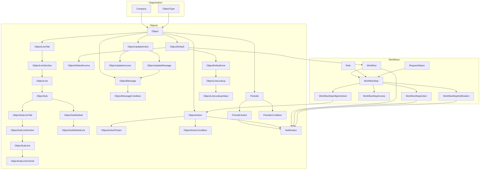

# Entity Hierarchy

Entities grouped as in Xeelo Admin site home (portlets).

## Portlet map

### Companies & Types
- **Company** — org unit; `Object.CompanyID`; tree icon `company.icon`
- **ObjectType** — categorization; `Object.ObjectTypeID`; tree icon/color on spec `objectType:`

### Objects
- **Object** — form definition
- **ObjectLineTab / Section / Line** — layout and fields
- **Subgrid (ObjectSub)** — embedded table on a type-5 line; may be shared across objects
- **ObjectDefault / ObjectDefaultLine** — template (defaults, validation, lookup, autonumber)
- **ObjectDefaultAccess** — create-form visible/editable per template (same dual-list as update/workflow access)
- **Lookup / Reference / Autonumber** — field data sources; autonumber is a sequence catalog bound on the template line
- **Update action (ObjectUpdateAction)** — post-completion user update → new request version; **ObjectUpdateAccess** = visible/editable on the update form
- **Object message (ObjectMessage)** — localized HTML modal (Cancel/Continue) on create, update, or workflow; junctions on template / update action / workflow
- **Object action (ObjectAction)** — server automation on save/workflow (`WorkflowStepObjectAction`)
- **Periodic** — scheduled automation
- **Calendar** — work calendars

### Workflows
- **Workflow** — process header (initial role/status, fail/recall handlers)
- **WorkflowStep** — step = role + status (+ optional org chart)
- **WorkflowStepAction** — transition buttons
- **WorkflowStepAccess** — which object lines are visible/editable on a step
- **WorkflowStepObjectAction** — which ObjectActions run at this step
- **WorkflowStepNotification** — extra email templates on a step
- **Role**, **RequestStatus** — reference data (usually pre-existing)

### Integrations & outputs
- **Export / Import** — data pipelines
- **Notification** — email templates (site catalog; OT child of workflow / ObjectAction / Periodic). [notifications.md](entities/notifications.md)
- **Printout / Report** — documents. [outputs.md](entities/outputs.md)
- **Scheduler, Object Service, Webhook** — automation

### Users (config UI, limited transfer)
- **User, UserAccess, Delegation, OrgChart** — **users not in DB transfer**

### Application Setup
- **Database Transfer** — full config XML/ZIP
- **Object Transfer** — selective object subtree

## DB transfer scope

110 tables — full list in [`data/transfer-tables.json`](../data/transfer-tables.json).

Priority tables for **create object** recipe:

`Company`, `ObjectType`, `Object`, `ObjectLineTab`, `ObjectLineSection`, `ObjectLine`, `ObjectLineOnGrid`, `ObjectSub`, `ObjectSubLineTab`, `ObjectSubLineSection`, `ObjectSubLine`, `ObjectSubLineOnGrid`, `LanguageTable`, `TableComments`, `ObjectLineLookup`, `ObjectLineLookupValue`, `ObjectLineAutoNumber`, `Notification`, `NotificationCondition`, `NotificationAttachment`, `Workflow`, `WorkflowStep`, `WorkflowStepAction`, `WorkflowStepNotification`, `ObjectDefault`, `ObjectDefaultAccess`, `ObjectDefaultLine`, `ObjectSubDefault`, `ObjectSubDefaultLine`, `ObjectUpdateAction`, `ObjectUpdateAccess`, `ObjectAction`, `ObjectActionParam`, `ObjectActionCondition`, `WorkflowStepObjectAction`

## Entity docs

Detailed semantics from admin hints:

| Doc | Entities |
|-----|----------|
| [entities/object-model.md](entities/object-model.md) | Object, lines, templates, create access, lookups, autonumber, unique, **subgrid** |
| [entities/object-line-types.md](entities/object-line-types.md) | ObjectLine types 1–20, extras, template capabilities |
| [entities/xeelo-grammar.md](entities/xeelo-grammar.md) | Extended validation + Client-Math/String expressions |
| [entities/update-actions.md](entities/update-actions.md) | ObjectUpdateAction, access, conditions |
| [entities/object-messages.md](entities/object-messages.md) | ObjectMessage HTML modal, styles, update/create/workflow junctions |
| [entities/notifications.md](entities/notifications.md) | Email templates, recipients, placeholders, workflow / ObjectAction / Periodic bindings |
| [entities/object-actions.md](entities/object-actions.md) | ObjectAction, params, conditions, Run Node.js |
| [entities/nodejs-esm.md](entities/nodejs-esm.md) | ESM `CustomJS`, `Context`, no refresh on current request |
| [entities/graphql.md](entities/graphql.md) | `Select_` / `Mutate_` names, query args, `createType`, `lines` vs `linesFormatted` |
| [entities/workflow.md](entities/workflow.md) | Workflow, steps, actions |
| [entities/integrations.md](entities/integrations.md) | Export, import, periodic, scheduler |
| [entities/outputs.md](entities/outputs.md) | Printout, report |
| [entities/users-and-access.md](entities/users-and-access.md) | Users vs transfer scope |
| [entities/localization.md](entities/localization.md) | `LanguageTable` translations |
| [entities/comments.md](entities/comments.md) | `TableComments` HTML notes on config entities |
