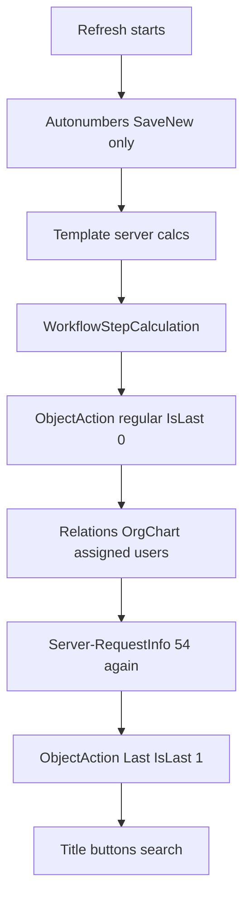

# Request refresh

Server pipeline after save, first submit, or a workflow event. One procedure (`spRequestRefreshGeneral`) with an `@RequestAction` event. Canonical “when does what run” for calculations, assigned users, and regular vs Last object actions.

Related: [object-actions.md](object-actions.md) · [workflow.md](workflow.md#workflowstepcalculation) · [object-line-types.md](object-line-types.md#server-calculations) · [graphql.md](graphql.md) · [nodejs.md](nodejs.md)

## Events

| `@RequestAction` | When |
|------------------|------|
| **`SaveNew`** | First submit. The request is marked submitted, **then** this refresh runs. |
| **`Save`** | Later save of an already-submitted request (form Save, type-18 button save). |
| **`WorkflowAction`** | After a footer **WorkflowStepAction**. Role/status are **already committed**; refresh sees the **new** pair. |
| **`WorkflowFail`** / **`WorkflowRecall`** / **`WorkflowUpdate`** / **`ExportFail`** | Fail, recall, change-role ObjectAction (`WorkflowUpdate`), export-fail. Same calc / ObjectAction pattern as `WorkflowAction`. |
| **`ImportInitial`** | First-submit import path. Autonumbers + relations / assigned users only. |

Status change is **not** a step inside the refresh. A workflow button updates `RoleID` / `RequestStatusID` first; `WorkflowAction` then runs on that target step. GraphQL `withRefresh: true` is a `Save` on an existing submitted row. Periodic is **not** this pipeline — [nodejs.md](nodejs.md#periodic--graphql-mutate-must-refresh).

## Order

| Step | SaveNew | Save | Workflow-like | ImportInitial |
|------|:-------:|:----:|:-------------:|:-------------:|
| Autonumbers | yes | — | — | yes |
| Template server calcs (all types) | yes | yes* | — | — |
| WorkflowStepCalculation (all types) | yes | — | yes | — |
| ObjectAction regular (`IsLast=0`) | yes | yes | yes | — |
| Relations, OrgChart, assigned users | yes | yes | yes | yes |
| Server-RequestInfo **54** (template) | yes | yes | yes | — |
| Server-RequestInfo **54** (workflow) | yes | — | yes | — |
| Notifications, export | yes | — | yes | — |
| ObjectAction Last (`IsLast=1`) | yes | yes | yes | — |
| Request title, reset buttons, search | yes | yes | — | — |

**Workflow-like** = `WorkflowAction`, `WorkflowFail`, `WorkflowRecall`, `WorkflowUpdate`, `ExportFail`.

\* **Save** skips the first template-calc pass when the current step has `WorkflowStepIsSuppressDefaultCalculation` **and** there is no active `RequestChange` for this save.

ObjectActions bind to the **current** workflow step (`WorkflowStepObjectAction`). After a footer button that is already the **target** step.

## Design ObjectAction: Last vs assignment

Assigned-user recalc (`spRequestWorkflowUserCondition` — who gets the request in Inbox) sits **between** the two ObjectAction passes. That is the design split:

| The action… | Pass | Why |
|-------------|------|-----|
| **Writes** owner, OrgChart, or any field the inbox assignment reads | **Regular** (`IsLast=0`) | Assignment on **this** refresh still sees the write |
| **Reads** role / status / assigned users to **display** (badge, assignee chips) | **Last** (`IsLast=1`) | Assignment (and Server-RequestInfo **54**) already ran |

Do **not** put owner / assignment inputs in Last — the same refresh will assign from the **previous** values. Do **not** default every Node.js script to Last. After a workflow **button**, role/status are already the new pair before either pass; Last is still required for a badge that shows **who was just assigned**.

Details: [object-actions.md](object-actions.md#run-nodejs).

## Template vs workflow calculations

**Template** server calcs live on `ObjectDefaultLine` (types **51+**, plus type-5 parents). They run at the **start** of `SaveNew` / `Save` (see suppress above). They do **not** run on `WorkflowAction` — that is why a template Server-String **53** badge stays stale until the next Save. Write the chip in Last (or a WorkflowStepCalculation **53**) — [object-actions.md](object-actions.md#runtime).

**WorkflowStepCalculation** rows on the current step run at the **start** of `SaveNew` and workflow-like events, **before** regular ObjectAction. They do **not** run on `Save`. Same type catalog as template server calcs. Use them to set a line the following regular action reads.

## Server-RequestInfo (54)

Catalog name **Server-RequestInfo** (`ObjectDefaultLineCalculationTypeID` / workflow calc type **54**). Formula is a request-placeholder string (assigned users, requestor, …).

| Pass | What runs |
|------|-----------|
| **Start** | Type 54 is included in the full template / workflow calc pass above (when that pass runs). |
| **End** | A **54-only** pass after assigned-user recalc and **before** Last ObjectAction. |

The second pass exists so placeholders that depend on inbox assignment / request info are current after `spRequestWorkflowUserCondition`. Template **54** runs on Save / SaveNew / workflow-like. Workflow **54** runs on those except `Save`.

## Regular vs Last ObjectAction

Two execute passes on Save / SaveNew / workflow-like (`ObjectActionTypeIsLast` 0 then 1). Choose the pass from [assignment above](#design-objectaction-last-vs-assignment). Types and `ApplicableEventType`: [object-actions.md](object-actions.md#run-nodejs).

## ImportInitial

Autonumbers, then relations / OrgChart / assigned users / performance. **No** server calcs, **no** ObjectAction, **no** notifications or export.
